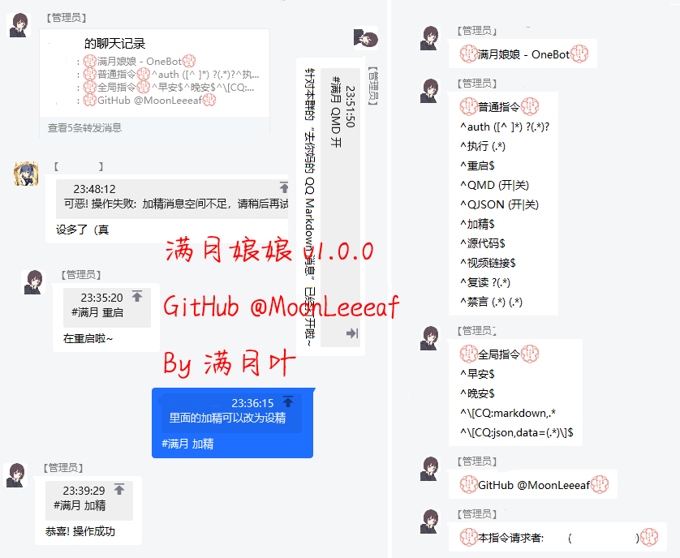

# 满月娘娘 - OneBot

## 概览

MoonBot 是一个基于已有的 OneBot 服务(如 NapCat)运行的一个小小的 QQ 群机器人

目前虽然没有什么好玩的功能, 不过也算对我以前用 QRSpeed 词库的一个纪念了

现阶段功能还是挺少的

## 截图

演示内容:指令列表, 设为精华, 开关MD消息解析, 重启, 以及一个幸运群友()

## 使用

0. 启动一个 OneBot 实例

1. 克隆本仓库

2. 运行`npm install`

3. 修改`config.json`中的`onebot_server`, 例如`ws://localhost:1145`

4. 运行`main.js`

5. Enjoy it :D

## 协议

本项目使用 Apache License 2.0 进行开源

## 感谢

[cqhttp-ts](https://github.com/yuanxin518/cqhttp-ts)
